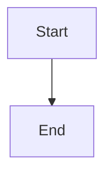

# DOCX export test

Open this file in Daisy, choose **File ▸ Export ▸ Word…**, then open the result in Word and compare it with the checklist at the end.

## Inline formatting

Plain text, **bold**, *italic*, ***bold italic***, ~~strikethrough~~, `inline code`, and a [link to GitHub](https://github.com). A soft
line break inside a paragraph should become a space.  
This line follows a hard line break.

Special characters: & < > "quotes" 'apostrophes' — em dash, … ellipsis, café, 日本語, emoji 🙂.

### Heading level 3

#### Heading level 4

##### Heading level 5

###### Heading level 6

## Lists

- First bullet
- Second bullet
  - Nested bullet
    - Third level
  - Back to second level
- Third bullet with a continuation paragraph.

  This paragraph belongs to the third bullet.

1. First step
2. Second step
   1. Sub-step a
   2. Sub-step b
3. Third step

Numbering must restart for this second list:

1. Alpha
2. Beta

Starting at a different number:

5. Five
6. Six

Task list:

- [x] Done item
- [ ] Open item

## Tables

| Name     | Role      | Count |
| :------- | :-------: | ----: |
| Alice    | Engineer  |    12 |
| Bob      | Designer  |     7 |
| Charlotte with a long name that should wrap inside its cell | Manager | 1,204 |

Table with inline formatting:

| Syntax | Result |
| ------ | ------ |
| `code` | **bold** and *italic* |
| [link](https://example.com) | ~~gone~~ |

## Code

```swift
struct Greeter {
    let name: String

    func greet() -> String {
        "Hello, \(name)!"   // trailing comment
    }
}
```

```
Plain block, no language.
	Tab-indented line, and <angle> & ampersand.
```

## Blockquotes

> A single quote that is long enough to wrap onto a second line so the left border and indent can be checked properly.
>
> > A nested quote.

## Images

A local image (embedded if the file exists next to this document):


A remote image (exported as a link, not embedded):


## Horizontal rule

Text above.

---

Text below.

## Mermaid

The diagram below becomes a centred picture with "Start" above "End".



## Known unsupported (expected to differ)

Math stays as source text: $E = mc^2$

<div>Raw HTML block is dropped.</div>

## Checklist

- [ ] Body text is 11 pt Calibri; headings are visibly larger, in 6 levels
- [ ] Headings appear in Word's navigation pane
- [ ] Both ordered lists start at 1; the third starts at 5
- [ ] Nested bullets indent; the continuation paragraph lines up with its bullet
- [ ] Tables are real Word tables with a shaded header; alignment matches; long cell wraps
- [ ] Code is Menlo 10 pt in a shaded box, tabs and special characters preserved
- [ ] Quote has a left border; nested quote is indented further
- [ ] Links are blue and underlined and open the right URL
- [ ] Horizontal rule renders as a line
- [ ] Mermaid diagram is a sharp picture, not source text; it stays code when Mermaid is off in Settings
- [ ] Frontmatter does not appear at the top
